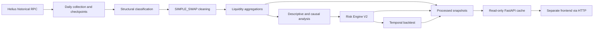

# Liquidity Radar

**Explainable liquidity risk analytics for historical SOL/USDC swap activity.**

Liquidity Radar turns structurally classified on-chain swaps into liquidity time series, causal risk indicators, position-specific exit estimates, and an honest temporal evaluation of their predictive value. The backend exposes these results through a read-only FastAPI service with OpenAPI contracts and a TypeScript client for an independently developed frontend.

**Current status: historical backend MVP, with a real-data demo and 92 automated tests.** Forward Liquidity Risk does not yet have convincing predictive validation. Estimated exit cost is an unvalidated volatility/turnover proxy, not observed or executable slippage.

## Why liquidity risk needs more than a price chart

Price and traded volume alone do not describe how volatile market conditions, thin activity, or imbalanced flows affect a hypothetical exit. A large position can also carry substantial operational exposure even when aggregate market conditions appear ordinary.

Liquidity Radar makes these distinctions explicit: current market severity, exploratory signals of future deterioration, and position exit risk are separate indicators. Every estimate retains its availability time, missing-data reasons, and extrapolation flags so that a small numerical cost is not mistaken for a reliable execution quote.

## Dataset and project scope

The current analysis uses one SOL/USDC pool and four UTC days of historical activity, from **June 30 through July 3, 2026**.

| Metric | Observed value |
| --- | ---: |
| Structurally classified and validated `SIMPLE_SWAP` records | **214,464** |
| Observed traded volume | **559,136,789 USDC**, approximately **US$559.1 million** |
| Historical coverage | **4 days** |
| Complete 1-minute time grid | **5,760 windows** |
| Aggregation intervals | **1m, 5m, 15m** |
| Position sizes | **10k, 50k, 100k, 250k, 500k, 1M USDC** |
| Exit-cost scenarios | **NORMAL, STRESS_25, STRESS_50, STRESS_75** |

These figures describe the full local processed dataset. A clean clone uses a smaller committed demonstration snapshot; it does not ship the complete swap history. “Validated” refers to structural classification, unit/price identities, and dataset integrity, not validation of executable liquidity or the exit-cost model.

## Main capabilities

- Incremental daily historical collection with checkpoints, retries, exponential backoff, and safe resume.
- Structural transaction classification into `SIMPLE_SWAP`, `COMPOSITE_SWAP`, `LIQUIDITY_OPERATION`, and `UNKNOWN`, with concurrent I/O and a single CSV writer.
- Signature-based cleaning that retains only `SIMPLE_SWAP`, without arbitrary price, volume, or volatility outlier removal.
- Continuous UTC liquidity aggregations, explicit empty windows, descriptive statistics, and separately maintained causal features.
- Risk Engine V2 with individual components, regimes, drivers, reliability flags, and missing-data explanations.
- Position/scenario stress estimates and a temporal holdout backtest against simple baselines.
- Cached, read-only REST endpoints, historical `as_of` selection, paginated series, CORS configuration, OpenAPI, and TypeScript types/client.
- A versioned, real-data demo that runs without Helius credentials or the complete historical CSVs.

## Architecture and technology



Historical acquisition is an offline workflow. **API startup and HTTP requests do not call Helius or execute the statistical models.** The server loads and validates existing outputs once, then serves an in-memory snapshot. Restarting the process is required to load another dataset version.

| Layer | Technology |
| --- | --- |
| Backend and offline pipeline | Python 3.12 |
| Statistical processing | NumPy, pandas |
| Historical RPC client | Requests, python-dotenv |
| HTTP API and contracts | FastAPI, Pydantic, Starlette |
| Local ASGI server | Uvicorn |
| Automated tests and response export | Standard-library `unittest`, FastAPI TestClient, HTTPX |
| Frontend integration | OpenAPI, generated TypeScript types and `fetchRadar` client |
| Storage | Local CSVs, JSON manifests, compressed demo snapshot |

The repository contains the backend and integration contracts. A Next.js frontend is developed separately; no completed UI, logo, trading execution, alerts, database, or deployment is bundled here.

## Historical processing pipeline

| Stage | Implementation | Purpose |
| --- | --- | --- |
| Collection | `src/data.py` | Daily swaps, incremental history, individual checkpoints and retry/recovery cycles |
| Classification | `src/classify_history.py`, `src/diagnostics.py` | Structural rules, unique-signature resume, threaded requests and incremental single-thread writes |
| Cleaning | `src/clean_history.py` | Exact signature joins, `SIMPLE_SWAP` selection, daily and consolidated cleaned CSVs |
| Liquidity | `src/liquidity.py` | 1m/5m/15m windows with conservation of swaps, volume and net flow |
| Features and stress | `src/features.py`, `src/stress.py` | Statistical features, causal references, position/scenario estimates and reliability flags |
| Technical audit | `src/audit_pipeline.py` | Traceable audit outputs and separate causal dataset versions |
| Risk V2 | `src/risk_v2.py` | Three distinct indicators from audited causal inputs |
| Holdout evaluation | `src/backtest_v2.py` | Frozen training thresholds, future events, baselines and robustness diagnostics |
| Serving | `src/api.py`, `src/api_data.py`, `src/api_contract.py` | Read, validate, cache and expose existing results |

Raw history, classifications, checkpoints, and full processed CSVs are excluded from Git. Rebuilding offline analyses requires those local inputs; it is not required to run the API, demo, or tests. The earlier `risk.py` and `backtest.py` remain available as previous implementations.

## Risk Engine V2

### Three indicators with different meanings

| Indicator | Components or inputs | Interpretation |
| --- | --- | --- |
| **Current Market Risk** | Volatility risk, inverted volume risk, absolute flow-imbalance risk, exit-cost risk for a fixed **100k USDC / NORMAL** reference | Severity of the current closed market window, independent of the user's position size |
| **Forward Liquidity Risk** | Equal mean of liquidity risk and flow risk | Exploratory deterioration signal, **not a calibrated probability or convincingly validated forecast** |
| **Position Exit Risk** | Estimated cost, participation, causal liquidity multiple and audited flags for each position/scenario | Operational exposure, kept separate from model reliability |

Percentile components compare the current observation with **strictly earlier valid observations**, using an expanding history and at least **120 valid prior observations per component**. Low volume means higher risk; flow uses its absolute imbalance. Current Market Risk is the simple mean of four components, while Forward Liquidity Risk uses only liquidity and flow. No arbitrary weights or partial means are introduced.

| Score regime | Initial policy |
| --- | --- |
| NORMAL | Score < 40 |
| WATCH | 40 <= score < 60 |
| STRESSED | 60 <= score < 80 |
| CRITICAL | Score >= 80 |
| INDETERMINATE | Essential components or historical information are unavailable |

The **40/60/80 boundaries are heuristic policies, not statistically calibrated thresholds**. Position Exit Risk instead uses LOW, MODERATE, HIGH, EXTREME, or INDETERMINATE based on the original participation/cost boundaries of 0.5/1/2. The highest triggered severity applies; missing essential data never becomes LOW.

`timestamp` marks a window's opening; `available_at` marks its closing. Full-period descriptive percentiles and medians are kept separate and are not used as historical information in V2 scores. Availability is theoretical window close, not measured ingestion latency or Solana finality.

### Stress and estimated exit cost

The existing square-root baseline is preserved:

```text
available_volume = observed_window_volume × scenario_multiplier
participation_rate = position_size / available_volume
estimated_exit_cost_pct = 100 × volatility × sqrt(participation_rate)
```

NORMAL uses all observed volume; STRESS_25, STRESS_50, and STRESS_75 retain 75%, 50%, and 25%, respectively. Volatility is the within-window sample standard deviation of log returns, without annualization. A `_pct` value of `0.5` means **0.5%**.

Traded volume is a proxy, not executable depth. The estimate excludes spread, fees, execution duration, and actual route conditions. Participation above observed turnover indicates extrapolation, not proof that execution is impossible. Costs above 100% are retained for audit rather than clipped or presented as validated quotes. Missing volatility is never replaced with zero.

Outputs propagate `model_reliability_status`, `extrapolation_warning`, `insufficient_liquidity_flag`, and `insufficient_data_flag`. **Estimated exit cost does not represent observed executable slippage.** See the [V2 specification](docs/risk_engine_v2.md) and [quantitative audit](docs/quantitative_technical_audit.md).

## Temporal out-of-sample backtest

Reference/training period: **June 30–July 2, 2026**. Chronological test period: **July 3, 2026**. Horizons: **5, 15, 30, and 60 minutes**.

Event thresholds and score-quartile boundaries are fitted only on the reference period and frozen during the test. Future events measure low volume, high volatility, high estimated cost for 100k/NORMAL, and their union. Only windows after the decision's closing time enter the target. Incomplete horizons and unknown measurements are explicitly identified; NaN is not treated as “no event.”

The evaluation compares both V2 indicators with current low volume, recent volume change, previous-condition persistence, and historical event prevalence. Outputs include precision, recall, false positive rate, lift, ROC-AUC, average precision, confusion matrices, lead time, exclusions, regime/quartile diagnostics, and a non-overlapping-target analysis. No thresholds, weights, or features were tuned to improve test results.

For **ANY_DETERIORATION at 5 minutes**, on the matched sample of 1,354 decisions:

| Indicator | Precision | Recall | ROC-AUC |
| --- | ---: | ---: | ---: |
| Current Market Risk | 58.6% | 50.8% | 0.570 |
| Forward Liquidity Risk | 59.5% | 58.2% | 0.568 |

Discrimination was modest, with no consistent superiority over simple volume baselines. At 60 minutes, event prevalence reached 99.7% on the matched sample, making precision alone misleading. The test day had already been inspected during earlier analysis, so this is a chronological holdout rather than untouched prospective evidence. One day and overlapping targets do not support strong significance claims. [Full backtest report](docs/backtest_v2.md).

## Repository layout

```text
.
├── src/
│   ├── api.py                  # FastAPI application
│   ├── api_data.py             # Snapshot loading, validation and cache
│   ├── api_contract.py         # Public Pydantic contracts
│   ├── data.py                 # Historical collection
│   ├── classify_history.py     # Resumable structural classification
│   ├── diagnostics.py          # Classification rules and diagnostics
│   ├── clean_history.py        # SIMPLE_SWAP cleaning
│   ├── liquidity.py            # Liquidity aggregations
│   ├── features.py             # Descriptive and causal statistics
│   ├── stress.py               # Exit-cost baseline and flags
│   ├── audit_pipeline.py       # Audited causal outputs
│   ├── risk_v2.py              # Current, forward and position indicators
│   ├── backtest_v2.py          # Temporal holdout evaluation
│   ├── risk.py                 # Earlier risk engine
│   ├── backtest.py             # Earlier backtest
│   └── alerts.py               # Empty placeholder; no alerts implemented
├── tests/                      # Six unittest modules
├── scripts/
│   ├── build_demo.py           # Optional real-data extraction
│   └── export_api_contract.py  # OpenAPI, TypeScript and example export
├── contracts/
│   ├── openapi.json
│   └── liquidity-radar.ts      # Types and fetchRadar HTTP client
├── data/
│   ├── demo/                   # Committed snapshot.json.gz and README
│   ├── raw/                    # Local/ignored when present
│   ├── historical/             # Local/ignored histories and checkpoints
│   └── processed/              # Local/ignored full generated datasets
├── docs/                       # API, audit, methodology and validation reports
├── .env.example                # Public configuration only
├── .gitignore
├── requirements.txt
├── README.md
└── main.py                     # Placeholder; use src.api for serving
```

`app/` and `notebooks/` may exist as empty local directories; they are not frontend deliverables. Full processed snapshots and their manifests are available only in the local data workflow, not in a clean clone.

## Installation and quick start

Use **Python 3.12**; the tested interpreter is 3.12.14. The nine required third-party packages are pinned in `requirements.txt`, with comments explaining runtime, pipeline, and testing roles. Clone the repository and run from its root.

### Install dependencies

```sh
python3.12 -m venv .venv
.venv/bin/python -m pip install -r requirements.txt
.venv/bin/python -m pip check
```

These examples use macOS/Linux paths. On Windows, use `.venv\Scripts\python.exe` in place of `.venv/bin/python`.

### Start FastAPI

```sh
.venv/bin/python -m uvicorn src.api:app --host 127.0.0.1 --port 8000 --env-file .env.example
```

If your Python environment is already activated, use `python -m uvicorn` with the same arguments. The application entry point is `src.api:app`, not `main.py`.

- **Swagger UI:** <http://127.0.0.1:8000/docs>
- **OpenAPI JSON:** <http://127.0.0.1:8000/openapi.json>

No Helius API key is required. The command loads the public `.env.example`; do not overwrite an existing `.env` containing collection credentials.

### Choose a dataset mode

| `RADAR_DATA_MODE` | Behavior |
| --- | --- |
| `auto` (default) | Uses the full local processed snapshot when present; otherwise uses the committed demo |
| `demo` | Uses only `data/demo/snapshot.json.gz`, regardless of local full datasets |
| `full` | Requires the complete local processed datasets and original version manifests |

To force the demo on macOS/Linux:

```sh
RADAR_DATA_MODE=demo .venv/bin/python -m uvicorn src.api:app --host 127.0.0.1 --port 8000 --env-file .env.example
```

A partial or invalid full dataset returns HTTP 503 instead of silently falling back. The demo contains **120 real minutes from July 3, 22:00–24:00 UTC**, six positions/four scenarios, and the original full-period backtest metrics. It is **176,618 bytes compressed**, with provenance and original causal scores; those scores are not recomputed using just the two-hour excerpt.

Consumers should display `meta.data_kind`, `meta.dataset_mode`, and `meta.coverage_notice`. Data must be identified as **HISTORICAL, never LIVE**. No acquisition, model rebuild, or demo extraction is needed for a clean clone to run.

Other configuration: `RADAR_CORS_ORIGINS` supplies comma-separated explicit origins, `RADAR_HISTORY_MAX_LIMIT` defaults to 2,000, and `RADAR_PROCESSED_DIR` optionally selects a local processed directory. Use one server worker for the MVP to avoid duplicating the complete cache in memory.

## API endpoints

All endpoints are **GET** and return typed JSON envelopes with metadata, explicit units, UTC ISO 8601 dates, finite numbers or `null`, and relevant availability/reliability reasons. No raw transactions, signatures, credentials, or local paths are served.

| Endpoint | Response |
| --- | --- |
| `/api/health` | Dataset readiness, API version, mode and cache load time |
| `/api/overview` | Closed-window totals and all three risk indicators |
| `/api/market-risk` | Current score/regime, components, drivers and fixed reference |
| `/api/forward-risk` | Forward score/regime, liquidity/flow components and drivers |
| `/api/positions` | Six operational exit evaluations; optional `scenario` |
| `/api/exit-cost?position_size=100000&scenario=NORMAL` | Cost, participation, causal liquidity multiple and reliability flags |
| `/api/liquidity/history?interval=1m` | Chronological 1m/5m/15m series with pagination |
| `/api/backtest/summary` | Indicator/baseline metrics, confusion matrices, exclusions and lead time |

Market, position, overview, and history endpoints accept `as_of` to select only windows closed at or before that instant. History accepts inclusive `start`, exclusive `end`, `limit` (default 300), and `offset` (default 0); ordering is ASC. Each series item includes the original **1m risk snapshot at its closing time**, not a newly aggregated 5m/15m score.

Backtest filters are `event`, `sample`, `horizon`, and `predictor`. This endpoint is explicitly retrospective and does not accept `as_of`. Invalid or repeated parameters return 422; timestamps require a timezone. Missing historical coverage returns 404, and unavailable datasets return 503. [Detailed API contract](docs/api.md).

```sh
curl -s http://127.0.0.1:8000/api/health
curl -s 'http://127.0.0.1:8000/api/market-risk?as_of=2026-07-03T23:00:00Z'
curl -s 'http://127.0.0.1:8000/api/exit-cost?position_size=100000&scenario=NORMAL'
curl -s 'http://127.0.0.1:8000/api/liquidity/history?interval=5m&limit=24'
curl -s 'http://127.0.0.1:8000/api/backtest/summary?event=ANY_DETERIORATION&horizon=5'
```

## Frontend integration

The frontend can be developed independently using [OpenAPI](contracts/openapi.json), [TypeScript types and client](contracts/liquidity-radar.ts), and [real response examples](docs/api_examples.json). It does not need Python or access to CSVs. CORS permits `http://localhost:3000` and `http://127.0.0.1:3000` by default; configure other explicit origins through the environment.

Copy `contracts/liquidity-radar.ts` into the frontend and set its `.env.local`:

```dotenv
NEXT_PUBLIC_RADAR_API_URL=http://127.0.0.1:8000
```

```ts
import { fetchRadar, type OverviewResponse } from './liquidity-radar';

const overview = await fetchRadar<OverviewResponse>(
  process.env.NEXT_PUBLIC_RADAR_API_URL!,
  '/api/overview',
);
```

Contracts/examples can be regenerated offline with `.venv/bin/python -m scripts.export_api_contract`. The demo is already committed; `scripts.build_demo` is an optional extraction tool requiring the full local inputs and deliberately refuses to overwrite an existing demo.

## Tests and validation

```sh
.venv/bin/python -m unittest discover -s tests -v
```

The suite uses the standard-library `unittest` runner, so pytest is not required. **92 tests** cover structural cleaning, conservation, numerical edge cases, causal references, minimum history, original risk formulas/regimes, future-event handling, and the API contracts. API tests also cover `as_of`, null serialization, flags, paging, CORS, cache reuse, safe errors, and operation without Helius.

A clean copy without ignored historical datasets or `.env` was validated in an isolated environment: dependency installation and `pip check` succeeded, all tests passed, and all eight endpoints plus Swagger/OpenAPI returned HTTP 200 using DEMO. See the [backend validation](docs/backend_mvp_validation.md) and [GitHub audit](docs/github_audit.md). HTTPX's TestClient integration currently emits a deprecation warning in the pinned Starlette version; the tested combination remains functional.

## Limitations and next steps

- Four days from one pool are insufficient to establish broad market behavior or convincing predictive performance. The holdout day was previously inspected; overlapping horizons and long-horizon saturation further limit inference.
- Forward Liquidity Risk remains an exploratory signal. Current Market Risk measures current severity; operational classes and percentile regimes are initial heuristic policies.
- Observed turnover is not executable liquidity. Exit estimates remain economically unvalidated, including extrapolated values above 100%, and must not be marketed as observed slippage or execution guarantees.
- Dust-sized swaps, extreme implicit prices, and limited within-window information can influence volatility. Original observations are preserved, with missingness and audit limitations documented.
- Window close is theoretical availability; real ingestion/finality delays are not measured. The API serves historical snapshots and has no automatic live updates, authentication layer, trade execution, alerting, or production deployment.

Next steps are to integrate the separate frontend, evaluate the frozen methodology on genuinely unseen periods, compare estimates with observed execution conditions, and measure data availability before considering live operation. These are planned validation tasks, not delivered capabilities.
